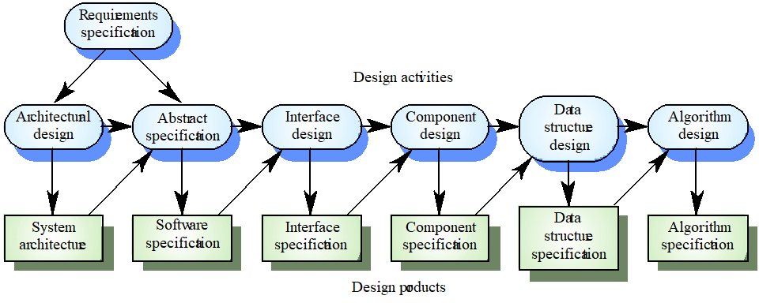

# Design Process Activities

Interface Design
Component Design
Data Structure Design
Data Structure Design
Algorithm Design

## Process

## Level of Design

Architectural Design

- hign-level design
- hard to change
  Detailed Design
- low-level design
- detailed enough to be implemented in the programming language
- the inner structure of the main modules

## Design Vs Architecture

Architecture is concerned with the selection of architectural elements, their interaction, and the constraints on those elements and their interactions

Design is concerned with the modularization and detailed interfaces of the design elements, their algorithms and procedures, and the data types needed to support the architecture and to satisfy the requirements.

Architecture…is specifically not about…details of implementations (e.g., algorithms and data structures.)

## Fatory affect design

Totally principle: All design requirements are always interrelated and must always be treated as such throughout a design task

- Requirement conflicts
- Requirement prioritization
- Design decisions

Time Principle: The features and characteristics of all products change as time passes.

- User friendliness
- Resource intensive

Value Principle: The characteristics of all products have different relative values depending upon the different circumstances and times in which they may be used.

Resource Principle: The design, manufacture and life of all products and systems depend upon the materials, tools and skills upon which we can call.

- development tools,
- run time support systems,
- human resource
- application domain-specific tools and equipment

Synthnesis Principle: All features of a product must combine to satisfy all the characteristics we expect it to possess with an acceptable relative importance for as long as we wish, bearing in mind the resources available to make and use it.

Iteration Principle: Design requires processes of evaluation that begin with the first intentions to explore the need for a product or system.

Change Principle:

- Design is a process of change, an activity undertaken not only to meet changing circumstance, but also to bring about changes to those circumstances by the nature of the product it creates.
- The design of a software system must take into consideration how it changes the way that we will work and live as the consequence of using the system.

Relationship Principle:

- Design work cannot be undertaken effectively without established working relationships with all stakeholders
- Customers, Users, System administrator, Project managers, Developers, Requirements analysts, Designers, Programmers, Testers:

Competence Principle: Design competence is the ability to create a synthesis of features that achieves all desired characteristics in terms of their required life and relative value, using available effective information

Sevice Principle: Design must satisfy everybody, and not just those for whom its products are directly intended.

- Easy to reuse
- easy to transport to other operation environments and to
- be inter-operable to other software systems, etc.

## Software Quality Models

McCall（分组/层次模型）：把质量属性分成几类（运维性、执行性、适用性等），每个属性通过问题/度量来评估。用于把“质量”具体化为可测要素
Perry（关系模型）：强调各质量属性之间的关系（直接/反向/中性），用来帮助理解改变一个属性对别的属性的影响。
